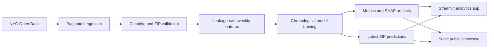

# RatRadar NYC

## Product Requirements Document

**Release:** 0.2 — Public Demo  
**Status:** MVP complete, launch polish in progress  
**Tagline:** See the surge before it lands.

---

## 1. The Pitch

Every Monday, New York City generates a new operating picture: complaints accelerate, familiar hotspots cool down, and a few ZIP codes begin behaving differently from their own historical baseline.

RatRadar finds those changes early.

It turns public NYC 311 history into a weekly, ZIP-level complaint-surge signal so an analyst can answer three questions in under 30 seconds:

1. **Where is complaint pressure most likely to spike next week?**
2. **What changed in those ZIP codes?**
3. **How much should the model be trusted?**

RatRadar is not a notebook, heatmap toy, or claim about literal rat population. It is a polished civic intelligence product for operational prioritization.

---

## 2. Product Truth

> RatRadar predicts rodent complaint surge risk, not rat population density.

311 activity reflects underlying conditions **and** reporting behavior, access, awareness, trust, and neighborhood norms. The product must present its output as an inspection-priority signal—not a verdict about a community.

This distinction is non-negotiable in the interface, documentation, demos, and portfolio narrative.

---

## 3. North Star

> A city operations analyst opens RatRadar on Monday morning and immediately sees where attention should move, what changed, and why the model believes it matters.

### North-star experience

- The citywide picture is understandable in one glance.
- The top-risk ZIPs are ranked, not buried.
- Each score has an intelligible explanation.
- Model quality and limitations are visible.
- The interface feels credible enough for a real operations room.

---

## 4. Current Release

The 0.2 release is a real, trained MVP—not a synthetic demo.

| Signal | Current value |
| --- | ---: |
| Official 311 Rodent records | 230,339 |
| Source range | January 1, 2020–June 6, 2026 |
| Mapped ZIP areas scored | 177 |
| ZIP-week modeling rows | 59,472 |
| Latest prediction date | June 1, 2026 |
| Test ROC-AUC | 0.780 |
| Test PR-AUC | 0.455 |
| Weekly top-10 precision | 0.488 |

### Release surfaces

1. **Full Streamlit application**
   - Complete analytical experience
   - Local reproducible pipeline
   - Six application pages
2. **Static public showcase**
   - Same latest model outputs
   - Interactive map, charts, filters, and ZIP drilldown
   - Optimized for reliable public deployment

---

## 5. Audience

### Primary: city operations analyst

Needs a weekly prioritization queue, clear supporting evidence, and enough model transparency to brief another team.

### Secondary: public-health or sanitation leader

Needs a concise citywide picture and confidence that the tool is operationally useful without overstating causality.

### Portfolio viewer

Needs to understand the product, technical depth, and design quality in under two minutes.

---

## 6. Jobs to Be Done

### Monday morning triage

> When a new operating week begins, show me which ZIP areas deserve attention so I can focus limited inspection capacity.

### Local investigation

> When a ZIP is flagged, show me whether the score comes from recent momentum, persistent baseline risk, volatility, or seasonality.

### Model review

> When I challenge a prediction, show me the validation design, benchmark quality, and feature importance so I can judge whether the ranking is defensible.

### Public explanation

> When I present RatRadar, help me explain what it predicts and what it explicitly does not claim.

---

## 7. Core User Journey

### Step 1 — Orient

The Overview presents:

- Prediction date
- ZIP areas scored
- Average citywide risk
- Test ROC-AUC and PR-AUC
- Weekly RatRadar Brief
- Citywide map
- Top-risk priority queue

### Step 2 — Scan

The Risk Map shows the spatial concentration of modeled risk using a consistent five-tier system:

| Probability | Tier |
| ---: | --- |
| 0–20% | Low |
| 20–40% | Watch |
| 40–60% | Elevated |
| 60–80% | High |
| 80–100% | Critical |

### Step 3 — Investigate

ZIP Intelligence presents:

- Current risk score and tier
- Recent complaint volume
- Eight-week baseline
- Complaint velocity
- Historical complaint chart
- Risk trajectory
- Rules-based “Why this ZIP?” explanation

### Step 4 — Challenge

Model Intelligence presents:

- ROC curve
- Precision-recall curve
- Confusion matrix
- Baseline comparison
- Global feature importance
- Chronological split dates

### Step 5 — Export

The Data Explorer supports filtering and CSV download for downstream analysis.

---

## 8. Modeling Contract

### Unit of prediction

```text
Mapped NYC ZIP area × Monday prediction date
```

### Prediction horizon

```text
Rodent-related 311 complaint activity during the next seven days
```

### Target

For ZIP `z` and prediction Monday `t`:

```text
future_rodent_count_7d(z, t) =
  complaints created from t through t + 6 days

surge_threshold(z, t) =
  75th percentile of completed weekly counts before t

target_surge(z, t) =
  1 when future_rodent_count_7d >= max(1, surge_threshold)
  0 otherwise
```

At least eight historical weeks are required before assigning a label.

### Leakage rules

- Features are shifted by at least one completed week.
- Expanding ZIP baselines use past data only.
- Surge thresholds use past data only.
- The incomplete current week is excluded from observed features.
- The latest scoring row has no known future target.
- Train, validation, and test periods are chronological.

---

## 9. MVP Feature Set

### Complaint momentum

- Complaints in the last 7, 14, 30, 60, and 90 days
- Four-week rolling mean
- Eight-week rolling mean
- Eight-week rolling standard deviation

### Change signals

- Seven-day versus monthly complaint velocity
- Fourteen-day versus sixty-day complaint velocity
- Days since the last complaint

### Persistent context

- Past-only ZIP baseline complaint rate
- Borough
- Week of year
- Month
- Quarter
- Year
- Summer and winter indicators

### Next signal layers

1. General 311 sanitation pressure
2. Citywide weather
3. Restaurant inspection pressure
4. Construction disturbance

Each layer must ship with an ablation report showing whether it improves ranking quality.

---

## 10. Model Requirements

### Models

- Logistic regression baseline
- XGBoost classifier

### Validation

- Train: February 24, 2020–July 1, 2024
- Validation: July 8, 2024–June 9, 2025
- Test: June 16, 2025–May 25, 2026

### Metrics

- ROC-AUC
- PR-AUC
- F1
- Precision
- Recall
- Confusion matrix
- Weekly top-10 precision

### Product metric

Top-10 precision is the primary operational metric:

> Of the ten ZIP areas ranked highest each week, how many actually surged?

---

## 11. Visual System

### Art direction

**Midnight Plum × Acid Lime × Signal Coral**

The system should feel like:

> an editorial intelligence terminal built for a city at night

### Palette

| Token | Color | Purpose |
| --- | --- | --- |
| Midnight | `#100A18` | Application background |
| Plum | `#21162F` | Cards and controls |
| Acid | `#D8FF4F` | Primary signal and active state |
| Ultraviolet | `#A78BFA` | Comparative and analytical signal |
| Signal Orange | `#FFB454` | Elevated attention |
| Signal Coral | `#FF6B7A` | High-risk and critical emphasis |
| Porcelain | `#FBF7FF` | Primary text |

### Principles

- Dark, but not generic navy
- High contrast without neon overload
- Editorial typography and generous spacing
- Maps and rankings lead; prose supports
- Risk colors remain semantically ordered
- Motion is restrained and informative

### Voice

Use:

- Complaint velocity
- Civic signal strength
- Inspection priority
- Persistent baseline risk
- Signal concentration
- What changed?

Avoid:

- Rat-infested
- Dirtiest neighborhood
- Worst ZIP
- Guaranteed surge

---

## 12. Technical Architecture



### Storage

- Raw and intermediate data: Parquet
- Model bundle: Joblib
- Metrics: JSON
- Mapping: MODZCTA GeoJSON
- Public showcase: compact JSON derived from model artifacts

---

## 13. Launch Requirements

The public demo is launch-ready when:

- All six analytical views load without errors.
- Every latest prediction maps to a visible polygon.
- The latest model benchmark is visible.
- ZIP drilldown charts update correctly.
- Data filters and CSV export work.
- Demo GIFs reflect the current visual system.
- README contains a live demo link and run instructions.
- PRD, context, technical notes, and release notes are current.
- Ethical framing appears in both product surfaces.

---

## 14. Non-Goals

The current release does not attempt to:

- Estimate actual rat population density
- Recommend enforcement action automatically
- Replace field inspection
- Claim causal relationships
- Tune a complex model before validating signal quality
- Add census tract or building-level precision
- Use an LLM for weekly summaries

---

## 15. Success Criteria

### Product

- A first-time viewer understands the product in under 30 seconds.
- A technical reviewer can identify the target, split, and leakage controls.
- A portfolio reviewer sees a coherent product rather than disconnected ML outputs.

### Model

- XGBoost outperforms or meaningfully complements the linear baseline.
- Weekly top-10 precision remains the primary ranking benchmark.
- New data sources are accepted only when ablation evidence justifies them.

### Engineering

- `pytest`, Ruff, and Black pass.
- The pipeline runs from repository root.
- Public showcase data can be rebuilt with one command.
- Documentation allows context recovery without chat history.

---

## 16. Roadmap

### Release 0.3 — Signal Expansion

- General 311 sanitation features
- Weather features
- Feature-ablation report
- Local SHAP drivers in ZIP Intelligence

### Release 0.4 — Urban Pressure

- Restaurant inspection signals
- DOB permit disturbance
- Improved narrative explanations
- Borough comparison

### Release 1.0 — Operational Briefing

- Scheduled weekly prediction refresh
- Downloadable citywide briefing
- Historical “what changed?” comparisons
- Stable hosted analytics experience
- Final portfolio case study and demo video

---

## 17. Final Product Statement

RatRadar NYC is an interpretable early-warning system for weekly rodent complaint surges across New York City.

It combines leakage-safe time-series modeling, geospatial prioritization, transparent evaluation, and a polished civic-operations interface to show where complaint pressure may rise next—and why.

