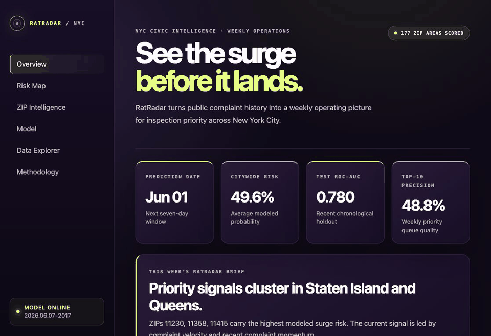
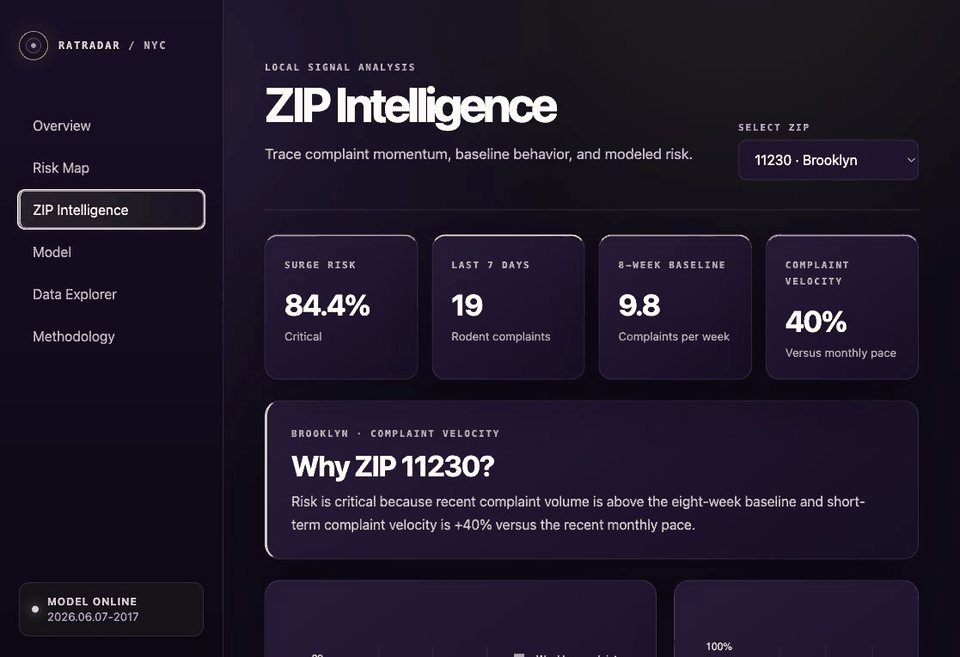

# RatRadar NYC

[](https://ratradar-nyc.vercel.app)
[](https://www.python.org/)
[](https://xgboost.readthedocs.io/)

RatRadar NYC is an interpretable civic-intelligence system that predicts next-week rodent complaint surges across 177 New York City ZIP areas.

It turns official NYC 311 history into leakage-safe weekly features, XGBoost risk scores, SHAP explanations, and a geospatial command-center dashboard built for rapid inspection prioritization. The complete release includes the trained model, prediction artifacts, interactive public showcase, browser-verified demo GIFs, and reproducible local pipeline.

RatRadar does not claim to measure actual rat population density. It predicts complaint surge risk based on public civic signals.

**Links:** [Live product](https://ratradar-nyc.vercel.app) · [Source repository](https://github.com/dhruvtoprani/ratradar-nyc) · [Product requirements](PRD.md) · [Deployment guide](DEPLOYMENT.md)



## Live Product

The public release is an interactive static showcase generated from the same latest model artifacts used by the full Streamlit application:

- [Open the deployed RatRadar demo](https://ratradar-nyc.vercel.app)
- Explore the citywide risk map
- Change ZIP areas in the drilldown
- Inspect model curves and feature importance
- Filter and download the latest prediction table



## Problem

NYC operational data contains signals that may precede changes in rodent complaint volume. RatRadar converts those signals into a weekly prioritization view:

> Which NYC ZIP codes are most likely to experience a rodent complaint surge next week, and why?

The MVP intentionally starts with rodent complaint history. Sanitation, weather, restaurant inspection, and construction features follow only after the end-to-end baseline works.

## Data

| Dataset | MVP status | Use |
| --- | --- | --- |
| [NYC 311 Service Requests, 2020–present](https://data.cityofnewyork.us/resource/erm2-nwe9.json) | Active | Target and complaint history |
| [NYC MODZCTA boundaries](https://data.cityofnewyork.us/resource/pri4-ifjk.geojson) | Active | ZIP-level map geometry |
| General 311 civic signals | Planned | Sanitation and operational pressure |
| Weather | Planned | Citywide weather amplification |
| Restaurant inspections | Planned | Food density and hygiene pressure |
| DOB permits | Planned | Construction disturbance |

## Modeling Approach

- Unit: one ZIP code × Monday prediction date
- Horizon: next 7 days
- Label: future weekly complaints at or above the ZIP's past-only expanding 75th percentile, with a minimum threshold of one complaint
- Features: lagged complaint counts, rolling means and volatility, velocity, recency, ZIP baseline, and calendar terms
- Validation: chronological train, validation, and test partitions
- Models: logistic regression baseline and `XGBoostClassifier`
- Product metric: weekly top-10 precision, alongside ROC-AUC, PR-AUC, F1, precision, and recall

## Dashboard

- Citywide risk overview and weekly brief
- Top-risk ZIP ranking
- MODZCTA risk choropleth
- ZIP complaint history and risk trajectory
- Model metrics, baseline comparison, and feature importance
- Filterable prediction explorer with CSV export
- Methodology, leakage controls, and ethical limitations

## Current Benchmark

| Metric | Result |
| --- | ---: |
| Mapped ZIP areas | 177 |
| ZIP-week rows | 59,472 |
| Test ROC-AUC | 0.780 |
| Test PR-AUC | 0.455 |
| Weekly top-10 precision | 0.488 |

## Run Locally

```bash
python3.11 -m venv .venv
source .venv/bin/activate
pip install -r requirements.txt

# macOS only, required by XGBoost if libomp is missing:
brew install libomp

python scripts/fetch_311_rodent.py
python scripts/fetch_zip_boundaries.py
python scripts/build_dataset.py
python scripts/train_model.py
streamlit run app/Home.py
```

Build and preview the deployable showcase:

```bash
python scripts/build_showcase.py
python -m http.server 4173 --directory web
```

Useful options:

```bash
python scripts/fetch_311_rodent.py --start-date 2023-01-01 --max-rows 100000
python scripts/build_dataset.py --input data/raw/311_rodent.parquet
python scripts/train_model.py --dataset data/processed/rodent_zip_week.parquet
python scripts/generate_predictions.py
python scripts/evaluate_model.py
pytest
```

Set `NYC_OPEN_DATA_APP_TOKEN` in `.env` for higher Socrata API limits.

## Project Structure

```text
app/                 Streamlit application and reusable UI components
data/                Raw, interim, processed, external, and prediction artifacts
models/              Trained model, feature schema, metrics, and explanations
scripts/             Reproducible command-line pipeline entry points
src/ratradar/        Data, feature, target, modeling, evaluation, and geo modules
tests/               Feature, target, and leakage tests
web/                 Deployable interactive public showcase
```

## Limitations

- 311 complaints reflect reporting behavior as well as underlying conditions.
- The MVP predicts complaint surges, not actual rat population density.
- MODZCTA areas are mapping approximations and can combine postal ZIP codes.
- Recent incomplete weeks are excluded from training.
- Historical complaint features can be predictive without proving a causal mechanism.
- The first MVP uses rodent complaint history only; external civic/weather signals are planned next.

Predictions should support inspection prioritization and analysis, not neighborhood stigmatization.

## Future Work

- Add sanitation and related 311 features
- Add citywide weather history
- Add restaurant inspection and DOB permit signals
- Promote SHAP values into local ZIP explanations
- Compare signal lift using controlled ablation reports
- Add scheduled refresh and full hosted Python deployment

## Documentation

- [Product requirements](PRD.md)
- [Deployment guide](DEPLOYMENT.md)
- [Release notes](RELEASE_NOTES.md)
- [Technical decisions](DEVNOTES.md)
- [Context recovery](CONTEXT.md)
